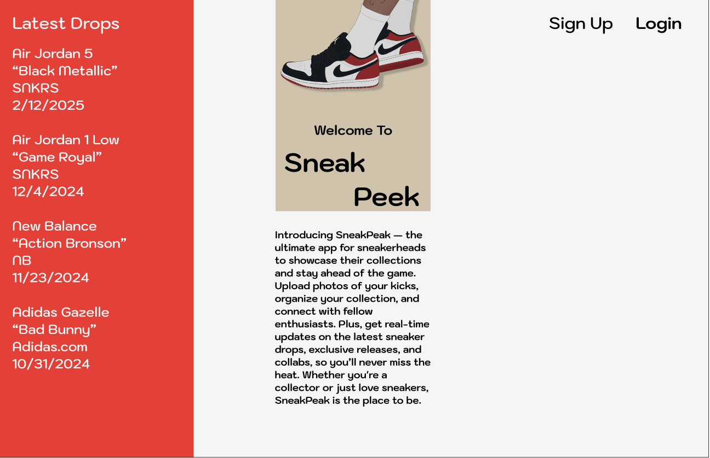
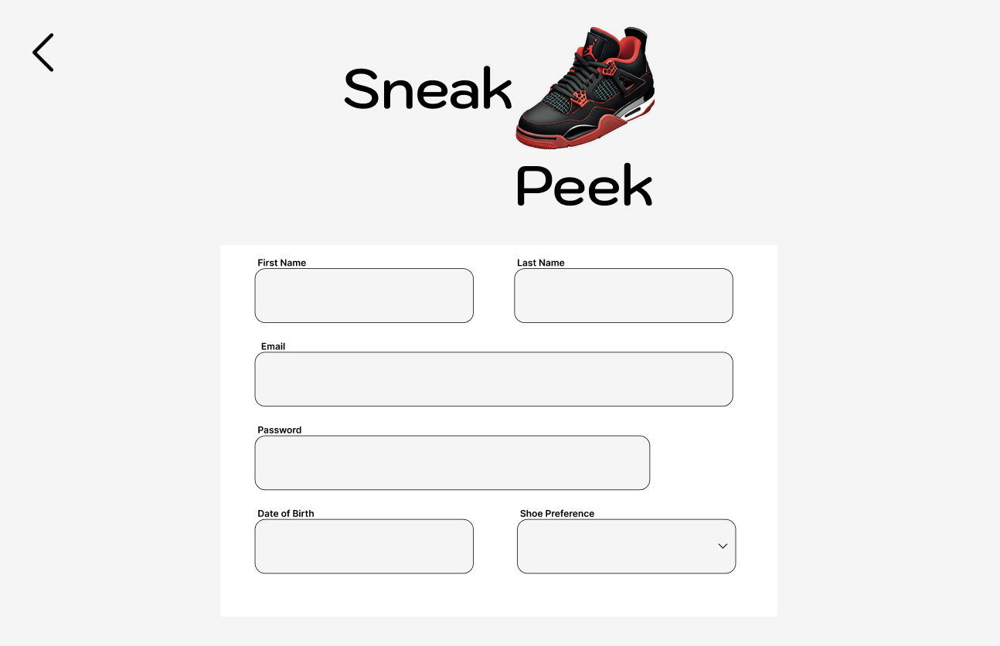
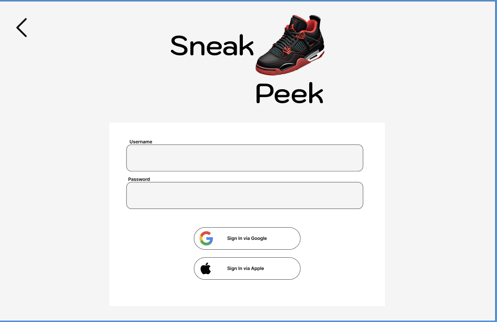
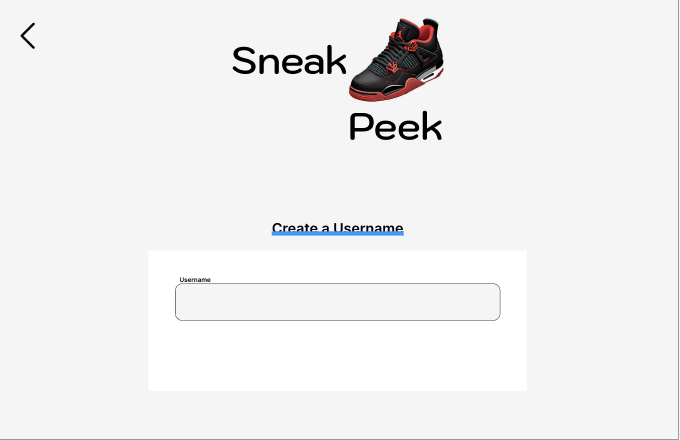
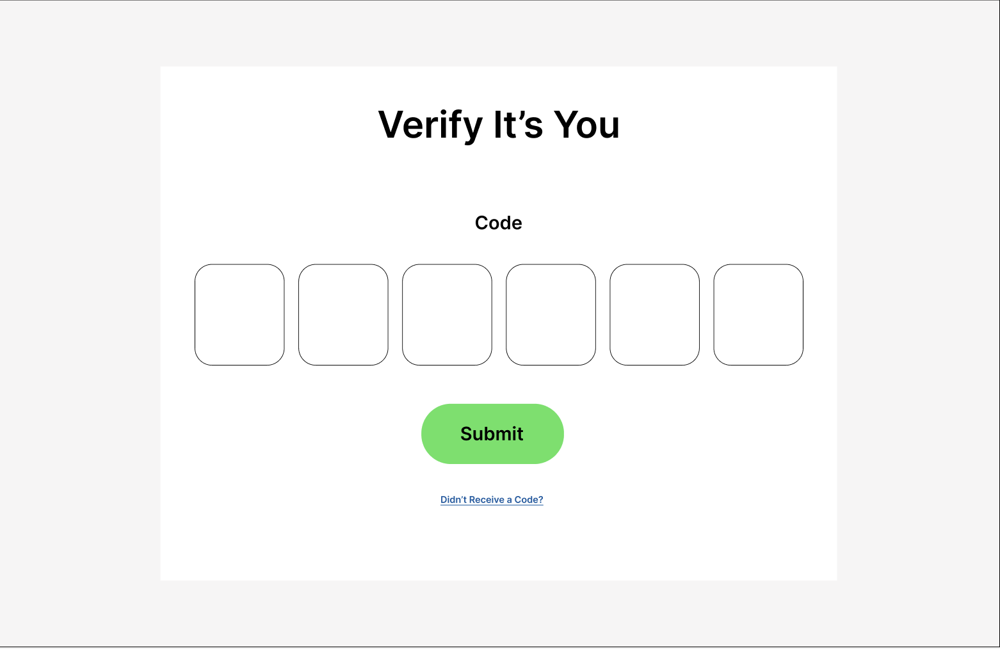
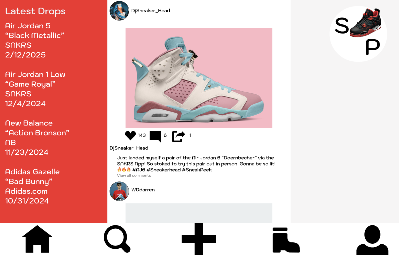
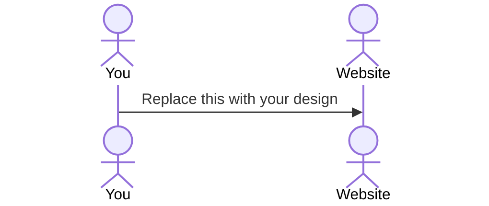

[My Notes](notes.md)

SneakPeak is a platform designed to unite sneakerheads and fashion enthusiasts by offering a space to share collections, discover new trends, and stay updated on the latest in sneaker culture. Users can create their own profiles, upload photos of their sneakers, and curate their collections in one place. Like Instagram, they can follow other accounts that post about the sneakers and styles they love, creating a personalized feed of the latest drops, fashion collaborations, and industry news. The app also serves as a hub for discovering upcoming releases and trends, ensuring users are always in the loop. SneakPeak is more than just a gallery — it's a community where sneakerheads can connect, share their passion, and stay at the forefront of the sneaker world.

> [!NOTE]
> This is a template for your startup application. You must modify this `README.md` file for each phase of your development. You only need to fill in the section for each deliverable when that deliverable is submitted in Canvas. Without completing the section for a deliverable, the TA will not know what to look for when grading your submission. Feel free to add additional information to each deliverable description, but make sure you at least have the list of rubric items and a description of what you did for each item.

> [!NOTE]
> If you are not familiar with Markdown then you should review the [documentation](https://docs.github.com/en/get-started/writing-on-github/getting-started-with-writing-and-formatting-on-github/basic-writing-and-formatting-syntax) before continuing.

## 🚀 Specification Deliverable

> [!NOTE]
> Fill in this sections as the submission artifact for this deliverable. You can refer to this [example](https://github.com/webprogramming260/startup-example/blob/main/README.md) for inspiration.

For this deliverable I did the following. I checked the box `[x]` and added a description for things I completed.

- [x] Proper use of Markdown
- [x] A concise and compelling elevator pitch
- [x] Description of key features
- [x] Description of how you will use each technology
- [x] One or more rough sketches of your application. Images must be embedded in this file using Markdown image references.

### Elevator pitch

SneakPeak is the ultimate platform for sneakerheads and fashion lovers to connect, share, and stay updated on the latest trends. It’s like Instagram for sneaker enthusiasts, where users can upload their collections, follow accounts that match their style, and discover the newest sneaker drops and fashion collabs. With personalized feeds, real-time updates, and a thriving community, SneakPeak keeps you in the know and at the forefront of sneaker culture. It’s the go-to space to share your passion, track the heat, and never miss a release. Join the sneaker revolution with SneakPeak!

### Design

 <!-- index.html -->

 <!-- signUp.html -->

 <!-- loginPage.html -->

The design of SneakPeak is simple and intuitive, providing a seamless user experience from start to finish. Upon visiting the landing page, users are greeted with key features like upcoming shoe drops and popular posts from the community. Users can easily create an account or log in via Google authentication for quick and secure access. Once logged in, they are taken to their personalized account where they can follow other users, share photos of their sneaker collections, and even post fashion trends and tips. The design emphasizes ease of navigation, allowing users to engage with the app's core functionalities effortlessly while staying connected to the latest in sneaker culture.

### Key features

1. Personalized Sneaker Feed
   Users can follow their favorite sneaker brands, influencers, and other collectors to create a tailored feed of sneaker releases, collection highlights, and fashion trends. This feature keeps users engaged and ensures they only see the content they care about, from upcoming drops to exclusive collaborations.

2. Release Calendar & Alerts
   A built-in sneaker release calendar that shows upcoming drops, limited edition releases, and exclusive collaborations. Users can set alerts for specific sneakers, ensuring they never miss out on a release they’re interested in. This keeps the app both informative and action-driven, making it essential for any sneakerhead.

3. Virtual Sneaker Collection & Trading
   Allow users to upload photos of their sneakers and create a virtual "collection" they can showcase, track, and update over time. Additionally, integrating a safe and easy way to trade or sell sneakers within the community would create a marketplace aspect, giving users more reason to interact with the app.

### Technologies

I am going to use the required technologies in the following ways.

- **HTML**

  HTML will be used to structure the content of the app, including the layout of user profiles, sneaker collections, and the sneaker feed. It will define the basic elements like headings, images, and buttons, ensuring a solid foundation for the front-end interface.

- **CSS**

  CSS will be used to style the application, creating an attractive, user-friendly design. This will involve customizing fonts, colors, and layout grids to ensure a sleek, modern look that aligns with sneaker culture. Responsive design will be implemented so the app looks great on both mobile and desktop devices.

  I have added more CSS to make the web app look welcoming and fun. I am establishing a sense of culture with the sneaker community by developing an all inclusive site for sneakerheads worldwide to connect and share their collections and ideas in one place.

- **React**

  React will be used to build the interactive front-end of the app. It will manage the dynamic components, like the user feed, sneaker collections, and real-time updates for sneaker releases. React's component-based architecture will allow for efficient rendering and seamless user interactions.

- **Service**

  The service layer will handle business logic, such as fetching data from external APIs (e.g., sneaker release info, fashion trends) and managing real-time updates for users. It will facilitate communication between the front-end and back-end, ensuring smooth data flow and functionality across the app.

- **DB/Login**

  Users will log in using their email and a chosen password. Google Authentication will be integrated for enhanced security, allowing users to log in through their Google account. This will ensure safe, hassle-free authentication while protecting against unauthorized access and data breaches.

- **WebSocket**

  WebSocket will be used to enable real-time communication between the app and the server. This will be crucial for live updates on sneaker releases, notifications for new posts in the user feed, and any other dynamic content that requires immediate synchronization between the server and the client. WebSocket ensures a smooth, responsive experience with minimal delay.

## 🚀 AWS deliverable

For this deliverable I did the following. I checked the box `[x]` and added a description for things I completed.

- [x] **Server deployed and accessible with custom domain name** - [My server link](https://sneakpeek360.com).

## 🚀 HTML deliverable

For this deliverable I did the following. I checked the box `[x]` and added a description for things I completed.

- [x] **HTML pages** - I did complete this part of the deliverable.
- [x] **Proper HTML element usage** - I did complete this part of the deliverable.
- [x] **Links** - I did complete this part of the deliverable.
- [x] **Text** - I not complete this part of the deliverable.
- [x] **3rd party API placeholder** - I did complete this part of the deliverable.
- [x] **Images** - I did complete this part of the deliverable.
- [x] **Login placeholder** - I did complete this part of the deliverable.
- [x] **DB data placeholder** - I did complete this part of the deliverable.
- [x] **WebSocket placeholder** - I did complete this part of the deliverable.

## 🚀 CSS deliverable

For this deliverable I did the following. I checked the box `[x]` and added a description for things I completed.

- [x] **Header, footer, and main content body** - I did complete this part of the deliverable.
- [x] **Navigation elements** - I did complete this part of the deliverable.
- [x] **Responsive to window resizing** - I did complete this part of the deliverable.
- [x] **Application elements** - I did complete this part of the deliverable.
- [x] **Application text content** - I not complete this part of the deliverable.
- [x] **Application images** - I did complete this part of the deliverable.

## 🚀 React part 1: Routing deliverable

For this deliverable I did the following. I checked the box `[x]` and added a description for things I completed.

- [ ] **Bundled using Vite** - I did not complete this part of the deliverable.
- [ ] **Components** - I did not complete this part of the deliverable.
- [ ] **Router** - Routing between login and voting components.

## 🚀 React part 2: Reactivity

For this deliverable I did the following. I checked the box `[x]` and added a description for things I completed.

- [ ] **All functionality implemented or mocked out** - I did not complete this part of the deliverable.
- [ ] **Hooks** - I did not complete this part of the deliverable.

## 🚀 Service deliverable

For this deliverable I did the following. I checked the box `[x]` and added a description for things I completed.

- [ ] **Node.js/Express HTTP service** - I did not complete this part of the deliverable.
- [ ] **Static middleware for frontend** - I did not complete this part of the deliverable.
- [ ] **Calls to third party endpoints** - I did not complete this part of the deliverable.
- [ ] **Backend service endpoints** - I did not complete this part of the deliverable.
- [ ] **Frontend calls service endpoints** - I did not complete this part of the deliverable.

## 🚀 DB/Login deliverable

For this deliverable I did the following. I checked the box `[x]` and added a description for things I completed.

- [ ] **User registration** - I did not complete this part of the deliverable.
- [ ] **User login and logout** - I did not complete this part of the deliverable.
- [ ] **Stores data in MongoDB** - I did not complete this part of the deliverable.
- [ ] **Stores credentials in MongoDB** - I did not complete this part of the deliverable.
- [ ] **Restricts functionality based on authentication** - I did not complete this part of the deliverable.

## 🚀 WebSocket deliverable

For this deliverable I did the following. I checked the box `[x]` and added a description for things I completed.

- [ ] **Backend listens for WebSocket connection** - I did not complete this part of the deliverable.
- [ ] **Frontend makes WebSocket connection** - I did not complete this part of the deliverable.
- [ ] **Data sent over WebSocket connection** - I did not complete this part of the deliverable.
- [ ] **WebSocket data displayed** - I did not complete this part of the deliverable.
- [ ] **Application is fully functional** - I did not complete this part of the deliverable.
